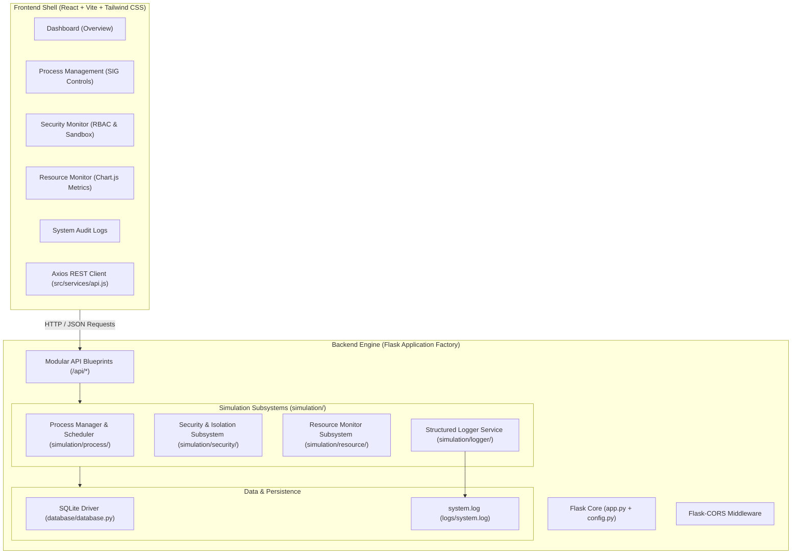

# System Architecture: OS-Level Process Security, Isolation & Resource Monitoring Simulator

## 1. High-Level Architectural Overview

The **OS-Level Process Security, Isolation & Resource Monitoring Simulator** is an educational, research-grade software platform that models fundamental operating system abstractions—specifically process lifecycle management, preemptive/cooperative scheduling, sandboxed isolation, capability-based security (RBAC), and hardware resource telemetry.



---

## 2. Subsystem Boundaries & Team Division

To facilitate concurrent, conflict-free development across 4 team members on GitHub, the project enforces strict separation of concerns:

### Subsystem A: Process Lifecycle & Scheduling Subsystem (`simulation/process/`)
- **Key Files**: `process.py`, `scheduler.py`, `process_manager.py`
- **Responsibilities**:
  - Process Control Block (PCB) state transitions (`READY`, `RUNNING`, `BLOCKED`, `SUSPENDED`, `TERMINATED`).
  - Scheduling algorithm implementations (Round-Robin, Priority Preemption, First-Come-First-Served).
  - Context switching mechanics and CPU burst calculation.
  - Signal dispatch handling (`SIGKILL`, `SIGSTOP`, `SIGCONT`).

### Subsystem B: Security, RBAC & Isolation Subsystem (`simulation/security/`)
- **Key Files**: `security.py`, `permissions.py`, `isolation.py`
- **Responsibilities**:
  - Role-Based Access Control (RBAC) matrices and Capability token verification.
  - Process Isolation & Containment (simulated namespaces and sandbox jails).
  - Anomaly heuristics (unauthorized syscall interception, privilege escalation flags).
  - Security audit logging and event dispatching.

### Subsystem C: Resource Monitoring & Telemetry Subsystem (`simulation/resource/`)
- **Key Files**: `resource_monitor.py`, `stats.py`
- **Responsibilities**:
  - Periodic CPU core utilization and load average calculation.
  - Virtual and physical memory frame accounting (RSS, cached buffer, paging simulation).
  - Disk block allocation and simulated I/O throughput (MB/s).
  - Per-process resource breakdown (threads, CPU %, memory allocation).

### Subsystem D: Architecture, API, Persistence & Frontend UI (Lead / Integration)
- **Key Files**: `app.py`, `config.py`, `api/*`, `database/*`, `frontend/src/*`
- **Responsibilities**:
  - REST API contracts, serialization, Blueprint routing, CORS middleware.
  - SQLite database connection management and schema migration hooks.
  - High-performance React UI shell, interactive dashboards, Chart.js visualizations, state management.

---

## 3. Communication Pattern
All frontend-to-backend communication flows through RESTful HTTP endpoints returning standardized JSON payloads formatted as:

```json
{
  "success": true,
  "message": "Human-readable status summary",
  "timestamp": "2026-09-27T18:45:00.000Z",
  "data": { ... },
  "error": null
}
```
